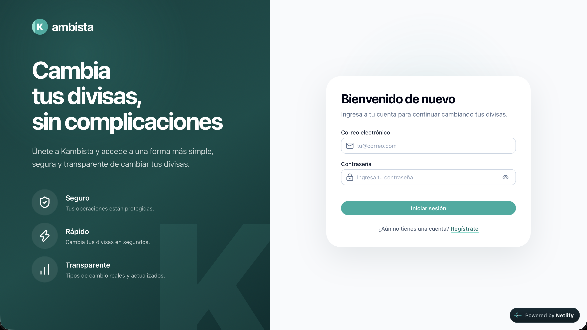
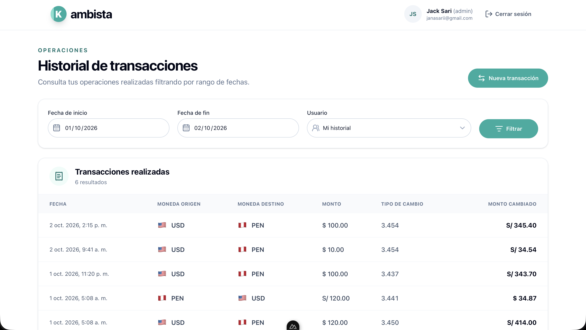

# Kambista Client

Frontend del reto técnico de Kambista, construido con Nuxt, TypeScript, Nuxt UI y Tailwind CSS.

## Demo

La aplicación desplegada está disponible en:

**[https://kambista-front.jacksari.com](https://kambista-front.jacksari.com)**

## Capturas

### Inicio de sesión



### Historial de transacciones



## Requisitos

- Node.js 22.19 o superior.
- npm 10 o superior.

## Configuración local

Antes de iniciar el frontend, la API debe estar ejecutándose y accesible desde la URL configurada en `NUXT_PUBLIC_API_BASE_URL`.

1. Instalar las dependencias:

   ```bash
   npm install
   ```

   Si npm muestra el error interno `Cannot read properties of null (reading 'edgesOut')`, utilizar:

   ```bash
   npm install --legacy-peer-deps
   ```

2. Crear el archivo de variables de entorno:

   ```bash
   cp .env.example .env
   ```

3. Iniciar el entorno de desarrollo:

   ```bash
   npm run dev
   ```

La aplicación se inicia en `http://localhost:3001`. Por defecto espera que la API esté disponible en `http://localhost:3000/v1`.

## Variables de entorno

El archivo `.env` debe definir la URL base de la API:

```env
NUXT_PUBLIC_API_BASE_URL=http://localhost:3000/v1
```

La variable es pública porque se utiliza desde el navegador. No debe contener secretos ni credenciales.

## Rutas

| Ruta | Acceso | Descripción |
|------|--------|-------------|
| `/login` | Invitados | Inicio de sesión. Un usuario autenticado es redirigido a `/`. |
| `/register` | Invitados | Registro de usuarios. Un usuario autenticado es redirigido a `/`. |
| `/` | Autenticado | Historial, filtros y creación de transacciones. |

Los middleware `guest` y `auth` controlan el acceso y restauran la sesión cuando corresponde.

## Scripts

- `npm run dev`: inicia Nuxt en modo desarrollo.
- `npm run build`: genera el build de producción.
- `npm run preview`: sirve localmente el build generado.
- `npm run test`: ejecuta todos los tests una vez.
- `npm run test:watch`: ejecuta Vitest en modo observación.

## Estructura

El código fuente vive en `src/` y se organiza por funcionalidades. Los componentes, composables y validaciones propios de cada flujo permanecen dentro de `features/`; los recursos compartidos se ubican en carpetas globales.

```text
src/
├── assets/                  # Estilos y recursos estáticos
├── components/ui/          # Componentes visuales compartidos
├── composables/            # Estado y lógica reutilizable entre features
├── features/
│   ├── auth/
│   │   ├── components/     # Formularios y presentación de autenticación
│   │   ├── composables/    # Flujos de login y registro
│   │   └── validation/     # Esquemas Zod de autenticación
│   └── transactions/
│       ├── components/     # Historial, filtros y modal de transacción
│       ├── composables/    # Creación, historial y usuarios administrables
│       ├── utils/          # Formateadores de moneda y fechas
│       └── validation/     # Esquemas Zod de filtros y transacciones
├── layouts/                # Layouts público, privado y general
├── middleware/             # Protección de rutas autenticadas y públicas
├── pages/                  # Rutas generadas por Nuxt
├── services/               # Comunicación con la API
├── stores/                 # Estado global y caché compartida
├── types/                  # Contratos TypeScript de requests y responses
└── utils/                  # Utilidades transversales
```

### Services

Los servicios representan las operaciones disponibles en la API. Solo construyen las solicitudes y retornan sus respuestas; no contienen estado visual ni lógica de componentes.

- `auth.service.ts`: login, registro y perfil.
- `exchange.service.ts`: tipo de cambio actual.
- `transaction.service.ts`: creación e historial de transacciones.
- `user.service.ts`: listado de usuarios para administradores.
- `http.client.ts`: configura la URL base, agrega automáticamente el token y centraliza el manejo de respuestas `401`.

Ejemplo de uso desde un composable:

```ts
const transactionService = useTransactionService()
const transaction = await transactionService.create(input)
```

### Composables

Los composables concentran el estado local y la interacción de una funcionalidad. Coordinan formularios, cálculos, estados de carga y mensajes de error, y consumen stores o services según corresponda.

Por ejemplo, `useCreateTransaction` calcula el monto estimado, intercambia monedas y registra la operación. El componente solo enlaza sus campos y renderiza el resultado del composable.

### Stores

Los stores de Pinia se reservan para información compartida entre pantallas o que necesita mantenerse durante la sesión:

- `auth.store.ts`: usuario autenticado, restauración y cierre de sesión.
- `exchange.store.ts`: tipo de cambio actual y caché de 30 segundos para evitar solicitudes duplicadas.

El token activo se comparte mediante `useState` y se persiste en una cookie desde `use-auth-session.ts`. `http.client.ts` utiliza ese estado para enviar el header `Authorization`.

### Flujo de datos

```text
Page o Component
       ↓
Composable
       ↓
Store o Service
       ↓
HTTP Client
       ↓
Backend API
```

Los componentes presentan datos y emiten eventos; los composables coordinan la interacción; los stores mantienen estado compartido; y los services aíslan la comunicación HTTP.

## Autenticación

La sesión utiliza el token retornado por `POST /auth/login` o `POST /auth/register`. Después de recibirlo, el cliente consulta `GET /auth/profile` para obtener al usuario autenticado. Al recargar una ruta protegida, el middleware valida nuevamente el token contra el perfil.

## Roles

| Rol | Comportamiento en el frontend |
|-----|-------------------------------|
| `user` | Crea transacciones y consulta únicamente su historial. |
| `admin` | Puede seleccionar un usuario y consultar su historial mediante el parámetro `userId`. |

El registro siempre crea usuarios con rol `user`. Para probar la funcionalidad administrativa, el rol debe asignarse directamente desde la base de datos o mediante el mecanismo provisto por el backend.

## Transacciones

La ruta principal protegida permite consultar el historial por rango de fechas, paginar resultados y registrar una nueva operación. El modal obtiene el tipo de cambio vigente desde `GET /exchange-rates/current`, muestra una estimación y confirma la operación mediante `POST /transactions`.

Cuando el perfil autenticado tiene el rol `admin`, el filtro muestra los usuarios obtenidos desde `GET /users` y permite consultar su historial enviando `userId`. Para usuarios con rol `user`, el selector no se renderiza y el parámetro nunca se envía.

## Tests

Los tests utilizan Vitest y el entorno de ejecución de Nuxt. Las dependencias externas se reemplazan con mocks ubicados en `tests/nuxt/mocks/`.

```text
tests/nuxt/
├── composables/            # Flujos reutilizables de las features
├── mocks/services/         # Respuestas y funciones simuladas de la API
├── stores/                 # Estado, sesión y caché
└── validation/             # Reglas de los esquemas Zod
```

Ejecutar toda la suite una vez:

```bash
npm run test
```

Ejecutar los tests mientras se desarrollan cambios:

```bash
npm run test:watch
```

La suite cubre autenticación, limpieza de sesión, caché del tipo de cambio, creación de transacciones y validaciones del formulario.
